# Hi, I'm Reza 👋

### Android Developer | Kotlin | Jetpack Compose

I'm an **Android Developer with 4 years of experience** building, publishing, and maintaining Android applications using **Kotlin and Jetpack Compose**.

I enjoy building complete products — from UI and architecture to networking, real-time communication, payments, monetization, and backend integration.

I have experience working with international technical teams and clients throughout the software development lifecycle.

---

## 🛠️ Tech Stack

**Android**

Kotlin • Jetpack Compose • Compose Navigation • MVVM • Coroutines • Flow • Compose State • XML

**Architecture & Storage**

Hilt • Room • DataStore • Paging 3 • Remote Mediator

**Networking**

Retrofit • REST APIs • GraphQL • Socket.IO • WebRTC • Gson

**Firebase**

Firebase • Firestore • FCM • Crashlytics

**Authentication & Payments**

Google Credential Manager • Google Play Billing • ZarinPal • Cafe Bazaar / Poolakey

**Other**

AdMob • Google Play Integrity API • OpenStreetMap • Charts • Coil • Glide • Rive

---

# 🚀 Featured Project

## DateMate — Dating & Social Connection App

> 🔒 **Source code is private because DateMate is a commercial project.**
>
> The screenshots below are provided to showcase the product and my work on the application.

**DateMate** is a full-featured social networking and dating platform built with **Kotlin and Jetpack Compose**.

Users can create personalized profiles, discover other users using advanced search filters, send friend requests, communicate through private or group chats, participate in events, and connect through video calls.

The application was published on **Google Play Store and Cafe Bazaar**.

### ✨ Main Features

* 👤 Personalized user profiles
* 🔎 Advanced user search and filtering
* 🤝 Friend requests and social connections
* 💬 Private and group messaging
* ⚡ Real-time communication with Socket.IO
* 📹 Video calls with WebRTC
* 🎉 Public and private events
* 📩 Event invitations
* 🚫 User blocking and reporting
* 🔔 Push notifications
* 💳 Premium subscriptions
* 💰 Multiple payment methods
* 📺 AdMob monetization
* 🛠️ Android-based administration panel
* 👨‍💻 User and report management
* 💬 Support chat management
* ⚙️ Remote application settings
* 🔐 Google authentication

These capabilities and integrations are described in my resume.

### 🧱 Architecture & Technologies

**Kotlin**
**Jetpack Compose**
**MVVM**
**Hilt**
**Retrofit**
**REST API**
**GraphQL**
**Socket.IO**
**WebRTC**
**Firebase Cloud Messaging**
**Paging / Remote Mediator**
**AdMob**
**Google Play Billing**
**Google Credential Manager**

---

# 📱 DateMate Screenshots

### Authentication & Onboarding

  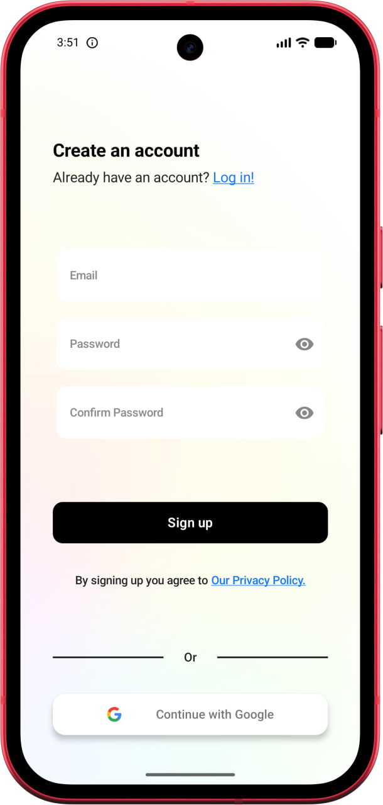
  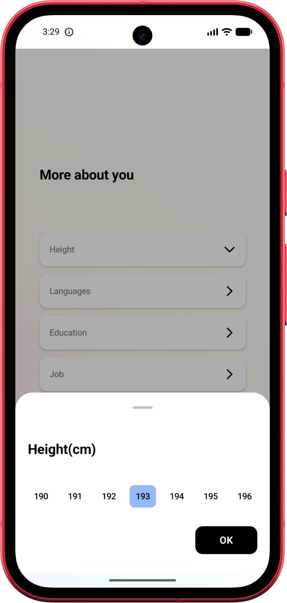
  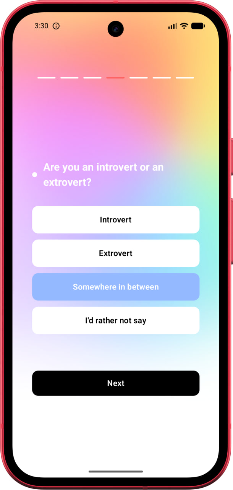

### Home & Discovery

  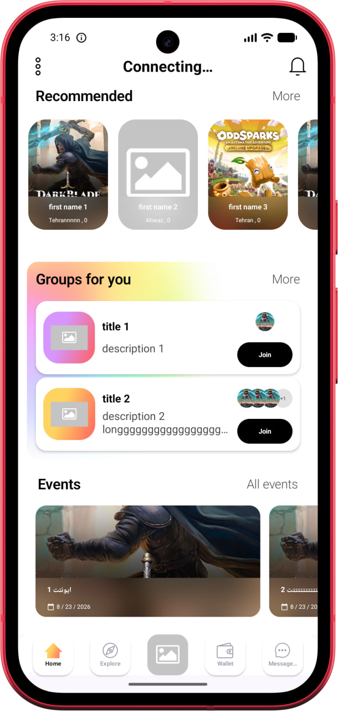
  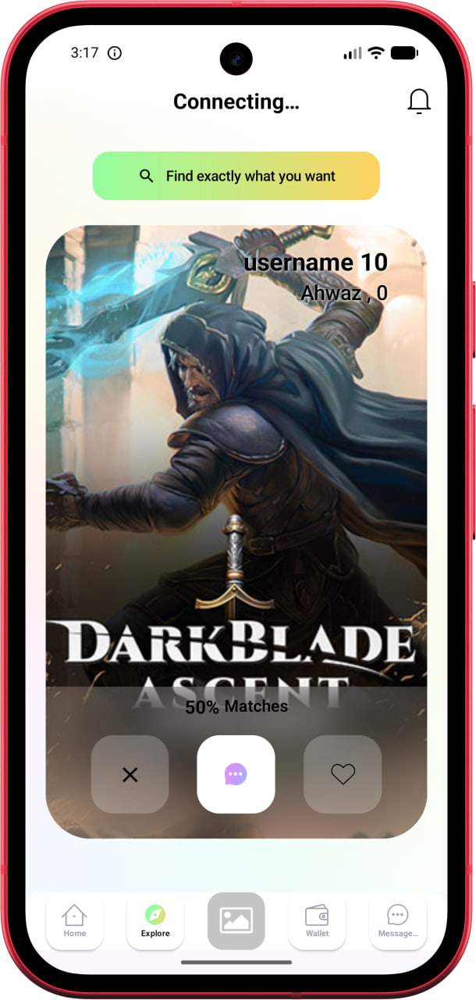
  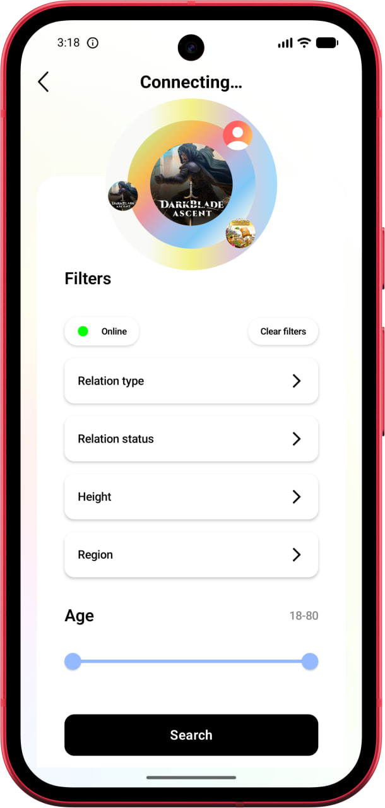
  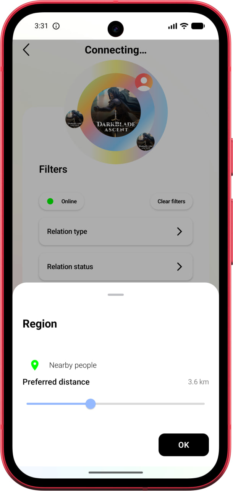

### Profiles & Social Features

  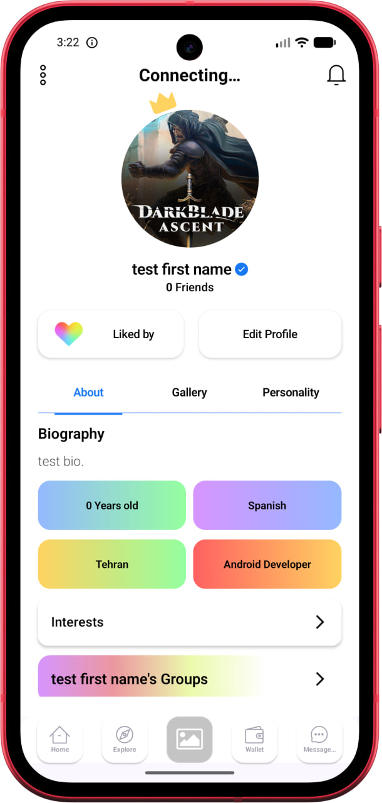
  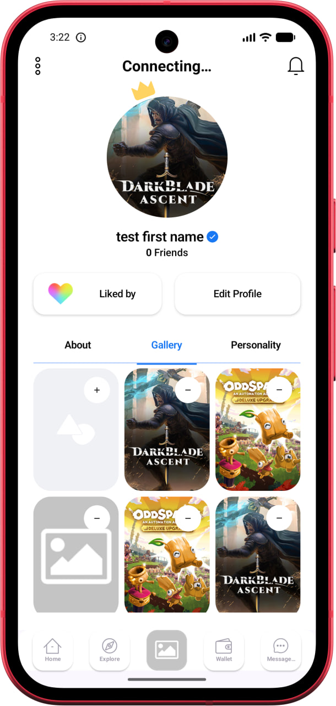
  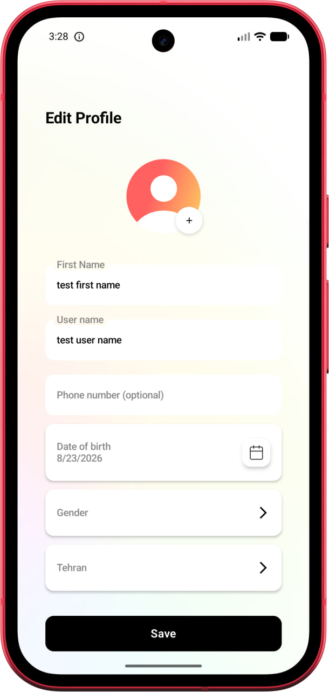
  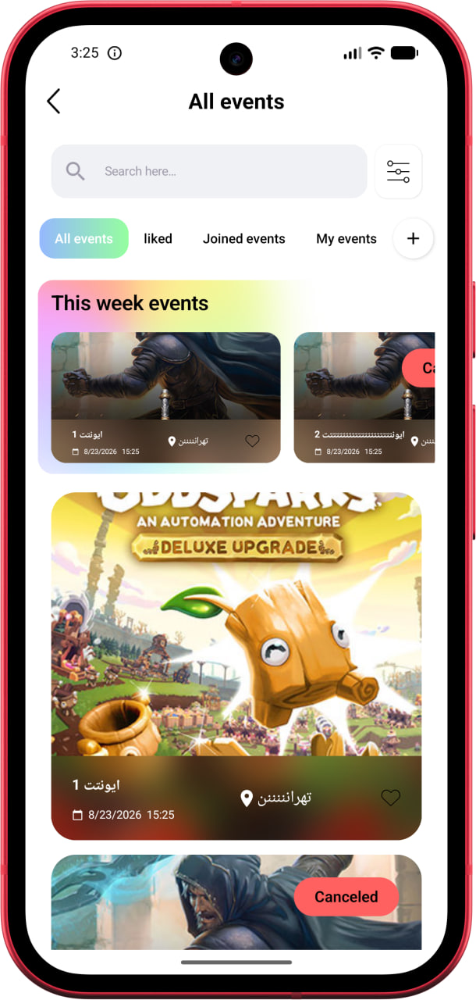

### Messaging & Communication

  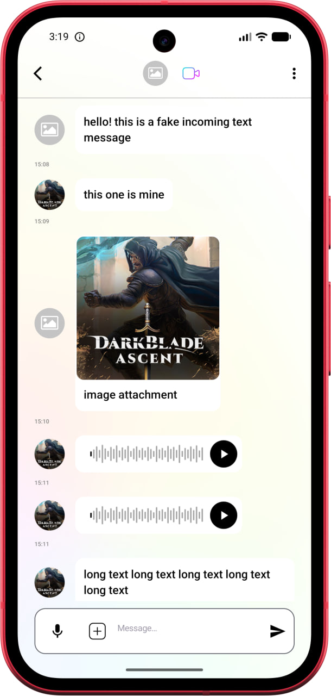
  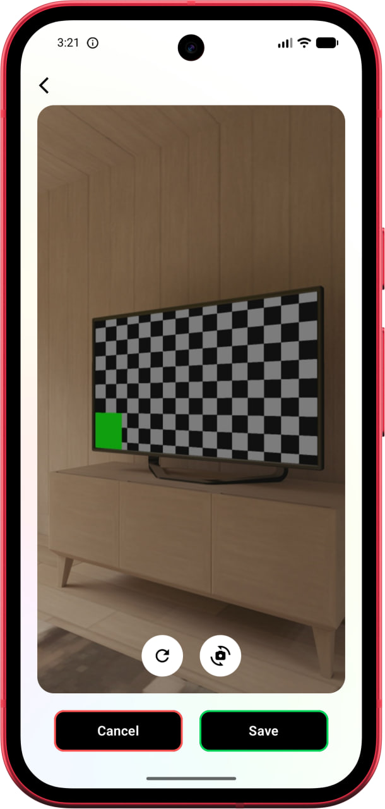
  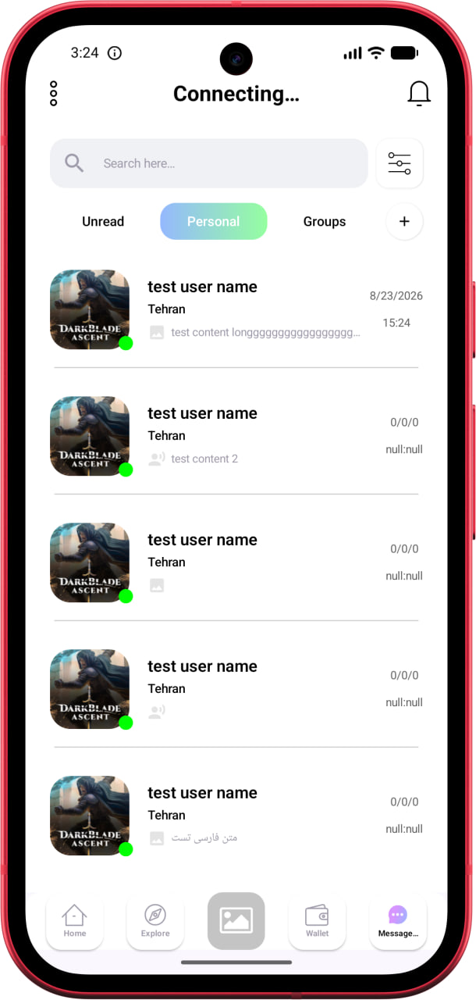

### Settings & Other Features

  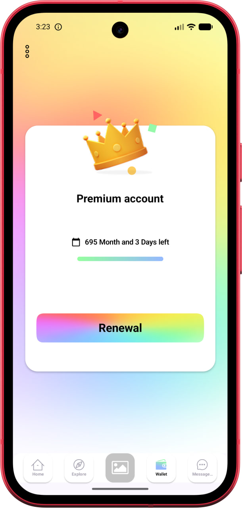
  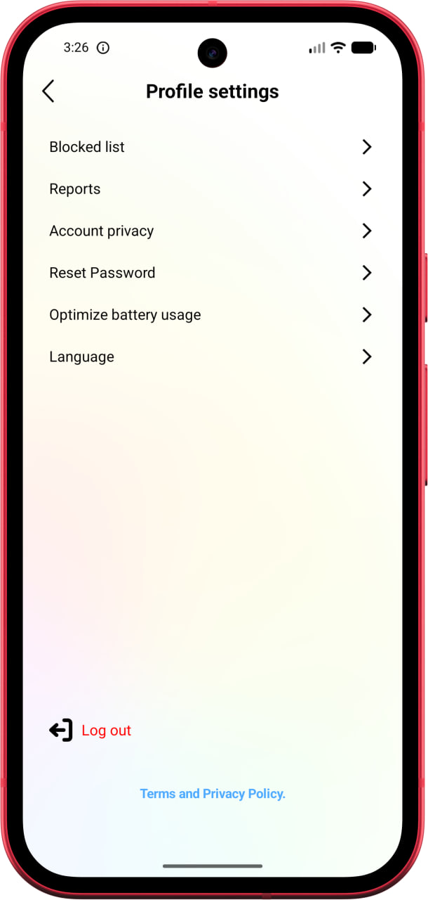
  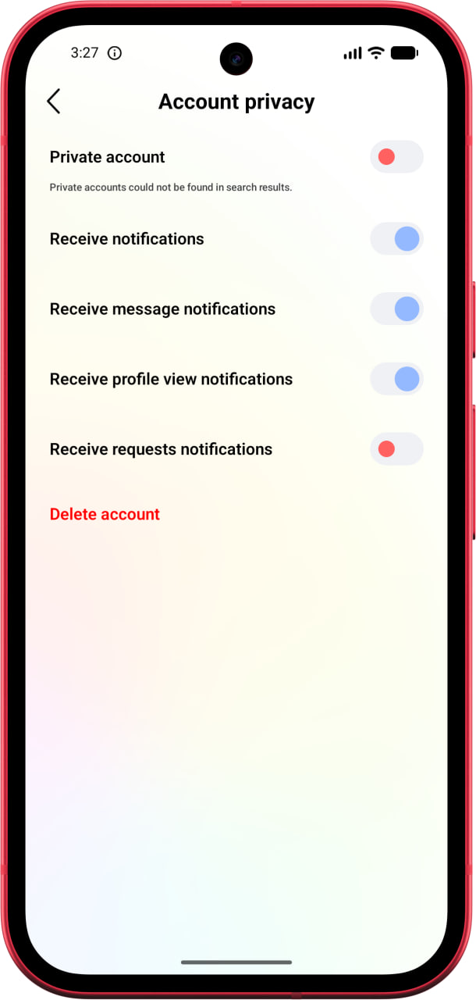
  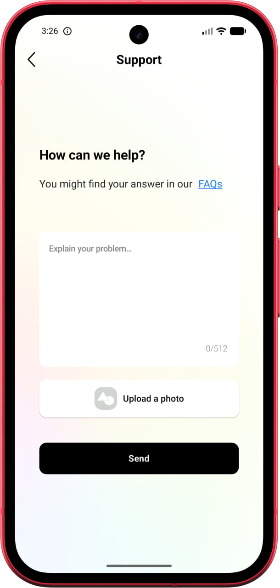

### Modified for all screen sizes

  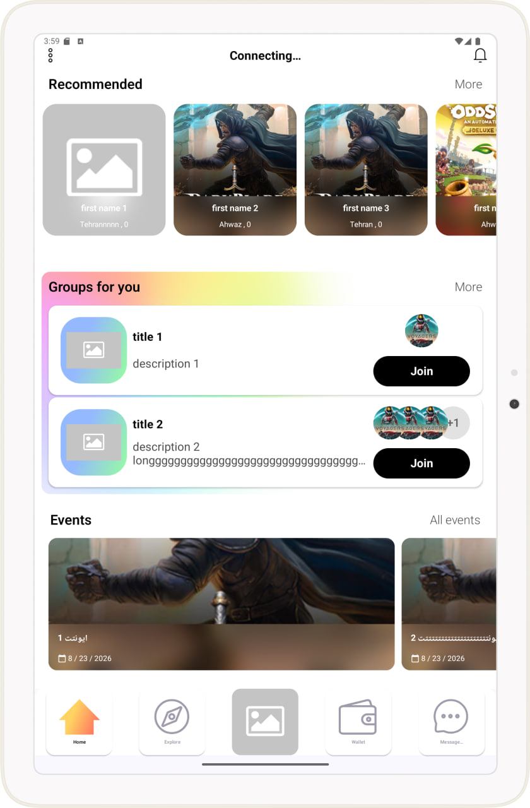
  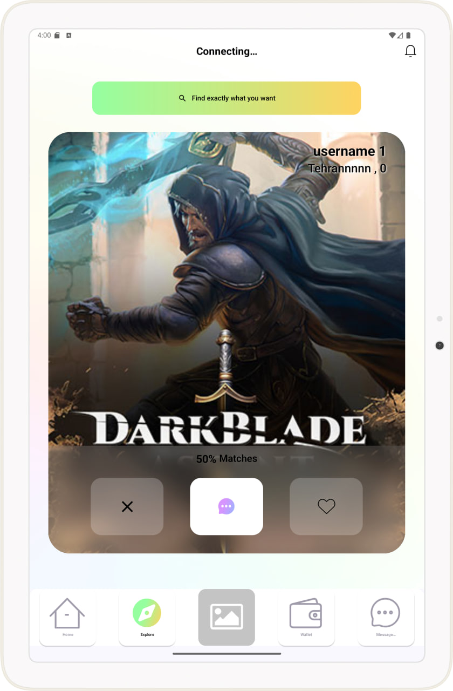

---

# 💡 Other Projects

## 🛒 Shopping App

An e-commerce Android application inspired by Digikala, featuring multiple product categories, favorites, shopping cart functionality, comments, payments, multilingual support, and light/dark themes.

**Technologies:** Kotlin, Jetpack Compose, MVVM, Retrofit, Room, Hilt, DataStore, Coroutines, Flow, Paging 3, Coil, Gson, Charts, ZarinPal.

---

## ⏳ Priceless — Scheduled Social Media

A social media application where users can create posts and schedule them to become available at a specific time. It also supports private comments and TON API integration for validating crypto purchases.

**Technologies:** Kotlin, XML, Firestore, REST API.

---

## ♟️ AI Chess — Play Chess with ChatGPT

An Android chess game where users play against an AI opponent powered by the OpenAI API.

After each player move, the current board state is sent to the AI, which returns the next move. The response is parsed and executed directly in the game.

**Technologies:** Kotlin, OpenAI API.

---

## 🤖 AI Chat App

A Jetpack Compose application that allows users to communicate with ChatGPT through the OpenAI API, including sending images and asking questions about them.

The app also includes a coin-based monetization system, AdMob integration, and real-time coin balance management through Firestore.

**Technologies:** Kotlin, Jetpack Compose, OpenAI API, Firestore, AdMob.

---

## 🔐 Custom VPN Application

A client-facing Android VPN application based on V2Ray/Xray, including authentication, user-specific bandwidth limitations, session tracking, activity logging, customized branding, and AdMob monetization.

**Technologies:** Kotlin, V2Ray/Xray-core, Appwrite, AdMob.

---

# 📈 What I Enjoy Building

* 📱 Modern Android applications
* 🎨 Jetpack Compose UIs
* 🏗️ Clean and scalable application architecture
* ⚡ Real-time communication
* 📹 Video calling applications
* 🤖 AI-powered applications
* 💳 Payment and subscription systems
* 📊 Data-driven applications
* 🔥 Firebase-powered applications
* 💰 App monetization
* 🚀 Production-ready mobile products

---

# 📫 Contact

**Reza Soleimani**

Android Developer
Tehran, Iran

📧 [RZSLMN90@gmail.com](mailto:RZSLMN90@gmail.com)

---

  <i>Building ideas into real Android products.</i>

